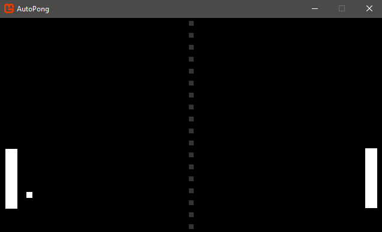

# AutoPong Sample

This project shows you how to make the classic game of pong, with basic soundfx, in 330 lines of code.

The tutorial includes:

* Program Architecture: Using public static classes and fields, regions
* Basic Physics: Velocity, Position, and Collisions
* Game State Management: Keeping Score, Resetting the game
* Basic SoundFX and Music: Playing a Reset Jingle, Paddle + Scoring Soundfx, Dynamic Sound Effect Instances

## Player Controls

AutoPong plays itself, so no player input is needed. You can change the code to accept player input, as an exercise.

## Exploring the Sample

* AutoPong is a single file game. To run it, simply replace your Game.cs file with AutoPong's Game.cs file.
* AutoPong doesn't load any content (pngs, wavs, etc...), instead content is created via code.
* AutoPong is designed using 3 classes: Game1, AudioSource, and AutoPong.
* The Game1 class is the expected Game class that all Monogame templates create and use.
* This game class creates, updates, and draws the AutoPong class.
* An AudioSource class is used to make soundfx and music.
* The AutoPong class contains all fields for the game: the ball, paddles, soundfx, and points.
* The AutoPong class is written using as few abstractions as possible, for simplicity.

## Running the Sample

* Create a new game, using a Monogame template. Run it and make sure it launches a cornflower blue window.
* Copy the contents of AutoPong's Game.cs file into your project's Game.cs file.
* Change AutoPong's namespace to your game's name space, if required. 
* Run it.