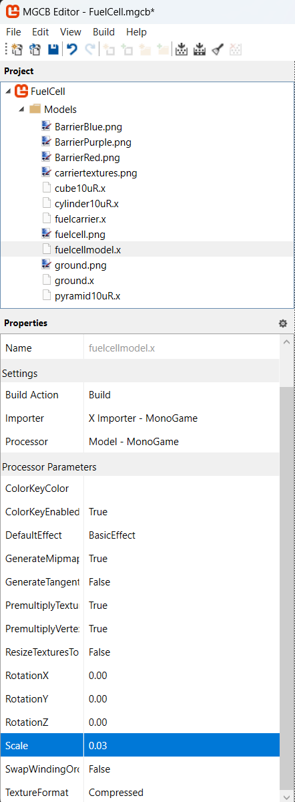
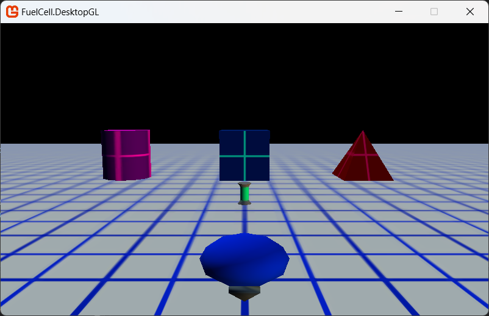
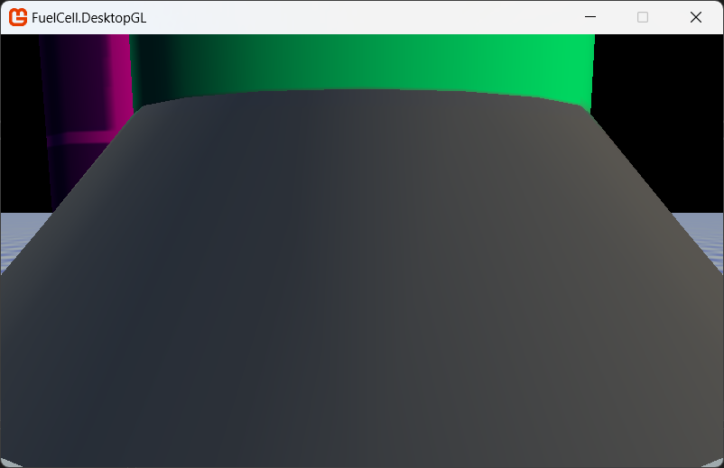

# FuelCell: Casting Call

## In this article

- [Supporting Cast](#supporting-cast)
- [Implementing the Fuel Cell Class](#implementing-the-fuel-cell-class)
- [Implementing the Barrier Class](#implementing-the-barrier-class)
- [Implementing the Fuel Carrier](#implementing-the-fuel-carrier)
- [Setting the Stage](#setting-the-stage)
- [See Also](#see-also)

Discusses the implementation of the remaining game elements, such as barriers, fuel cells, and an avatar model.

## Supporting Cast

It is time to add the remaining models: the fuel cells and the fuel carrier. They represent the various barriers encountered in the game.

The fuel cell model (`fuelcellmodel.x`) is a simple canister-like object with a single texture (`fuelcell.png`). Typically, you only need to add the model file and not the texture. The texture file is automatically used when the Content Pipeline processes the model file. The barrier models are similar to the fuel cell model. They each have a specific model and a single texture. Since the game has three barrier types, we will be adding three different models (`cube10uR.x`/`cylinder10uR.x`/`pyramid10uR.x`) and a set of textures (`BarrierBlue`/`BarrierPurple`/`BarrierRed.png`). Unlike the fuel cell model, the barrier textures are simple and can be used with any barrier model.

> [!NOTE]
> The rather unique model names are the result of keeping the scale relatively uniform among all models. The naming convention begins with the model name and then the radius, measured in the units of the 3D modeling application used. Therefore, pyramid10uR is the name of the pyramid model whose radius is 10 units in length.

- Open the MGCB Content project
- Right-click the `Models` directory icon of the Content project.
- Click `Add -> New Existing Item....`
- Download and then add the following files:
  - [fuelcellmodel.x](../FuelCell.Core/Content/Models/fuelcellmodel.x) and [fuelcell.png](../FuelCell.Core/Content/Models/fuelcell.png)
  - [fuelcarrier.x](../FuelCell.Core/Content/Models/fuelcarrier.x) and [carriertextures.png](../FuelCell.Core/Content/Models/carriertextures.png)
  - [cube10uR.x](../FuelCell.Core/Content/Models/cube10uR.x), [cylinder10uR.x](../FuelCell.Core/Content/Models/cylinder10uR.x), and [pyramid10uR.x](../FuelCell.Core/Content/Models/pyramid10uR.x)
  - [BarrierBlue.png](../FuelCell.Core/Content/Models/BarrierBlue.png), [BarrierPurple.png](../FuelCell.Core/Content/Models/BarrierPurple.png), and [BarrierRed.png](../FuelCell.Core/Content/Models/BarrierRed.png)

> [!TIP]
> Right-click and "save-as" each of the file links and then add them to your content project as described.

## Implementing the Fuel Cell Class

Model implementation is similar to what you did in the last step. You will add some member variables to store the models, load them with the `LoadContent` method, initialize them (placement, etc.) and then render them on the playing field.

First, the fuel cell class. Create a new class file called `FuelCell.cs` and replace its contents with the following.

```csharp
using Microsoft.Xna.Framework;
using Microsoft.Xna.Framework.Content;
using Microsoft.Xna.Framework.Graphics;

namespace FuelCell
{
    public class FuelCell : GameObject
    {
        public bool Retrieved { get; set; }

        public FuelCell()
            : base()
        {
            Retrieved = false;
        }

        public void LoadContent(ContentManager content, string modelName)
        {
            Model = content.Load<Model>(modelName);
            Position = Vector3.Down;
        }
    }
}
```

The `FuelCell` class extends ([using c# inheritance](https://learn.microsoft.com/en-us/dotnet/csharp/fundamentals/tutorials/inheritance)) its Base class `GameObject` with a new member `Retrieved`. This is a flag used by the game to determine if the fuel cell has been retrieved. The constructor uses the [base constructor](https://learn.microsoft.com/en-us/dotnet/csharp/language-reference/keywords/base), setting `Retrieved` to `false`. You will use this flag later to optimize your drawing code. If it has been found, it no longer needs to be drawn. The `LoadContent` loads the specified model and then sets the `Y-component` of the `Position` member to `-1`. That value is used as an indicator that the fuel cell has not been initialized.

This next bit of code declares a Draw method that takes a view and projection matrix and draws the fuel cell. Notice the check on the value of the Retrieved member. This is the optimization we discussed previously. If the fuel cell has been retrieved by the player, there is no need to draw the fuel cell. Add the following code to the FuelCell class.

```csharp
public void Draw(Matrix view, Matrix projection)
{
    Matrix translateMatrix = Matrix.CreateTranslation(Position);
    Matrix worldMatrix = translateMatrix;

    if (!Retrieved)
    {
        foreach (ModelMesh mesh in Model.Meshes)
        {
            foreach (BasicEffect effect in mesh.Effects)
            {
                effect.World = worldMatrix;
                effect.View = view;
                effect.Projection = projection;

                effect.EnableDefaultLighting();
                effect.PreferPerPixelLighting = true;
            }
            mesh.Draw();
        }
    }
}
```

We need to override the scale of the fuel cell model (`fuelcellmodel.x`) by selecting the newly-added model from Content Project and set the `Scale` property to `.03`, located on the property page of the model asset in the MGCB editor. The Scale property is found by expanding the Processor field.



One of the cool features of MonoGame (specifically, the content pipeline) are processor parameters. You can change common values for a processor by changing the related property of a selected game asset using the Properties window. If you didn't use this feature, you would need to use a scaling matrix to shrink the fuel cell model before rendering it on the screen.

> [!NOTE]
> Did you notice the Matrix declarations at the beginning of the Draw function? You need to transform the world coordinates of our object (in this case, the fuel cell) based on the fuel cell's position in the game. If the translation matrix wasn't used before drawing the fuel cell, it would always be in the center of the playing field.

That completes the implementation of the fuel class. Next stop, the barrier class.

## Implementing the Barrier Class

The Barrier class implements the geometrical barriers that are randomly scattered across the playing field. They are an important part of the game because they provide a new experience for every game (since they are placed randomly) and they provide a challenge to the player who is trying to find fuel cells (also randomly placed) before time runs out. In a later step, when collision detection is added, these barriers become impassable and must be driven around.

> [!NOTE]
> We need to scale the barrier models by selecting each barrier model (`cube10uR.x`/`cylinder10uR.x`/`pyramid10uR.x`) in the Content Project and sett the `Scale` property to `.3`, located on the property page of the model asset. The Scale property is found by expanding the Processor field, as we did previously for the `FuelCell` model.

Create a new class file called `Barrier.cs`, add replace its contents with the following:

```csharp
using Microsoft.Xna.Framework;
using Microsoft.Xna.Framework.Content;
using Microsoft.Xna.Framework.Graphics;

namespace FuelCell
{
    public class Barrier : GameObject
    {
        public string BarrierType { get; set; }

        public Barrier()
            : base()
        {
            BarrierType = null;
        }

        public void LoadContent(ContentManager content, string modelName)
        {
            Model = content.Load<Model>(modelName);
            BarrierType = modelName;
            Position = Vector3.Down;
        }
    }
}
```

The Barrier class has a new member (BarrierType) that stores, oddly enough, the barrier type. In the FuelCell game, there are three possible barrier types: cubes, cylinders, and pyramids. Similar to the FuelCell class, the LoadContent method is overridden that loads the specified model, stores the barrier type, and sets the Y-component of the Position member to -1 (indicating that the barrier is not placed).

Since barrier objects behave in a similar fashion to fuel cells (that is, they stay in one place and do nothing), we will use the same drawing code with one change. Add the following Draw method to the Barrier class:

```csharp
public void Draw(Matrix view, Matrix projection)
{
    Matrix translateMatrix = Matrix.CreateTranslation(Position);
    Matrix worldMatrix = translateMatrix;

    foreach (ModelMesh mesh in Model.Meshes)
    {
        foreach (BasicEffect effect in mesh.Effects)
        {
            effect.World = worldMatrix;
            effect.View = view;
            effect.Projection = projection;

            effect.EnableDefaultLighting();
            effect.PreferPerPixelLighting = true;
        }
        mesh.Draw();
    }
}
```

Unlike the fuel cells, barriers cannot be retrieved and are always visible. Therefore, there is no need to determine if a barrier should be drawn; it is always drawn. This is reflected in the code.

## Implementing the Fuel Carrier

In game development terms, the fuel carrier is the avatar of the player. It is the object that represents the player in the game world and is controlled by the player. The FuelCarrier class starts out very simple but, in later steps, you will add more features like user control and collision detection. For now, it has a few basic methods that load the model and render it on the playing field.

The process for implementing the fuel carrier class is similar to the `FuelCell` and `Barrier` class implementations.

Firstly, to support some new "defaults" for the FuelCarrier", add the following additional constants to the end of the `GameConstants` class, located in `GameConstants.cs`:

```csharp
//ship constants
public const float Velocity = 0.75f;
public const float TurnSpeed = 0.025f;
public const int MaxRange = 98;
```

> [!NOTE]
> We scale the fuel carrier model by selecting it in the Content Project and setting the `Scale` property to `.1`, located on the property page of the model asset. The `Scale` property is found by expanding the Processor field.

Next, create a new class file called `FuelCarrier.cs`, add replace its contents with the following:

```csharp
using Microsoft.Xna.Framework.Content;
using Microsoft.Xna.Framework.Graphics;

namespace FuelCell.Core.Game
{
    public class FuelCarrier : GameObject
    {
        public float ForwardDirection { get; set; }
        public int MaxRange { get; set; }

        public FuelCarrier()
            : base()
        {
            ForwardDirection = 0.0f;
            MaxRange = GameConstants.MaxRange;
        }

        public void LoadContent(ContentManager content, string modelName)
        {
            Model = content.Load<Model>(modelName);
        }
    }
}
```

As usual, the Fuel Carrier data members are specific to the class. In this case, there is:

- A `ForwardDirection` property that stores the current direction (in radians) that the fuel carrier is facing. This property is also used by the camera class to orientate along the same vector.
- The `MaxRange` member is used later to prevent the fuel carrier from driving off the playing field. This is something that would completely break the gameplay illusion.

As mentioned earlier, the methods are similar to the implementation code for the fuel cell and barrier classes. However, in the next part, you will add code that allows the player to drive the fuel carrier around the playing field. In fact, the fuel carrier has the singular honor of being the only moving part in the game!

Finally, implement the `Draw` method by adding the following code to the `FuelCarrier` class declaration:

```csharp
public void Draw(Matrix view, Matrix projection)
{
    Matrix worldMatrix = Matrix.Identity;
    Matrix rotationYMatrix = Matrix.CreateRotationY(ForwardDirection);
    Matrix translateMatrix = Matrix.CreateTranslation(Position);

    worldMatrix = rotationYMatrix * translateMatrix;

    foreach (ModelMesh mesh in Model.Meshes)
    {
        foreach (BasicEffect effect in mesh.Effects)
        {
            effect.World = worldMatrix;
            effect.View = view;
            effect.Projection = projection;

            effect.EnableDefaultLighting();
            effect.PreferPerPixelLighting = true;
        }
        mesh.Draw();
    }
}
```

## Setting the Stage

It is time to shift our focus back to the main game class, `FuelCellGame.cs`. You are going to add member variables to represent the new game objects you added:

- The fuel carrier
- The fuel cell
- and various barriers.

At this stage, we will display a fuel cell, three barriers (each of a different type), and the fuel carrier on the playing field. Later in the development cycle, you will add code that randomly generates and places the fuel cells and barriers.

In `FuelCellGame.cs`, after the declaration of the camera and ground variables, add the following code:

```csharp
// Game objects
FuelCarrier fuelCarrier;
FuelCell[] fuelCells;
Barrier[] barriers;
```

Then after the initialization of the camera and ground variables (located in the `LoadCOntent` method), add the following code:

```csharp
// Initialize and place fuel cell
fuelCells = new FuelCell[1];
fuelCells[0] = new FuelCell();
fuelCells[0].LoadContent(Content, "Models/fuelcell");
fuelCells[0].Position = new Vector3(0, 0, 15);

// Initialize and place barriers
barriers = new Barrier[3];

barriers[0] = new Barrier();
barriers[0].LoadContent(Content, "Models/cube10uR");
barriers[0].Position = new Vector3(0, 0, 30);
barriers[1] = new Barrier();
barriers[1].LoadContent(Content, "Models/cylinder10uR");
barriers[1].Position = new Vector3(15, 0, 30);
barriers[2] = new Barrier();
barriers[2].LoadContent(Content, "Models/pyramid10uR");
barriers[2].Position = new Vector3(-15, 0, 30);

// Initialize and place fuel carrier
fuelCarrier = new FuelCarrier();
fuelCarrier.LoadContent(Content, "Models/fuelcarrier");
```

This code initializes all our new models and places them in front of the camera. The fuel cell is in the front row and the barriers are in a line behind it.

Finally, modify the existing `Draw` method by adding the following code after the `DrawTerrain()` call:

```csharp
// Draw the fuel cell
fuelCells[0].Draw(gameCamera.ViewMatrix, gameCamera.ProjectionMatrix);

// Draw the barriers
foreach (Barrier barrier in barriers)
{
    barrier.Draw(gameCamera.ViewMatrix, gameCamera.ProjectionMatrix);
}

// Draw the fuel carrier
fuelCarrier.Draw(gameCamera.ViewMatrix, gameCamera.ProjectionMatrix);
```

Build and run the project and you will now see, in addition to the playing field, several cool things on the screen. You see some barriers, with a fuel cell slightly behind them, and a funny blue ovoid in the foreground. That is actually the fuel carrier. It is a (very) simple model, but it suits the purpose of the game. The next step implements user control of the game avatar.



> [!IMPORTANT]
> If your game view does not look like the above screenshot and more like the one shown below.  Then you have **FORGOTTEN** to set the **SCALE** in the Content Processor properties in the MGCB tool.
> 
> Now go back and RTFM and set the `Scale` settings for each model accordingly in the MGCB tool.  Extra credit, guess how the author knew to put this note in.

## See Also

### Next

- [FuelCell: What's My Motivation](4-FuelCell-What-is-my-motivation.md)

### Conceptual

- [FuelCell: Introduction](../README.md)

### Tasks

- [How To: Render a Model]()